# The Hive Platform

> SWE 574 — Boğaziçi University, Spring 2026

---

## Software Design (UML Diagrams)

### Table of Contents

1. [Use Case Diagram](#1-use-case-diagram)
2. [Class Diagram (Domain Model)](#2-class-diagram-domain-model)
3. [Component Diagram (System Architecture)](#3-component-diagram-system-architecture)
4. [Sequence Diagrams](#4-sequence-diagrams)
   - 4.1 [User Authentication Flow](#41-user-authentication-flow)
   - 4.2 [Service Creation & Matching Flow](#42-service-creation--matching-flow)
   - 4.3 [TimeBank Transaction Flow](#43-timebank-transaction-flow)
5. [Activity Diagram — Service Exchange Lifecycle](#5-activity-diagram--service-exchange-lifecycle)
6. [Deployment Diagram](#6-deployment-diagram)
7. [State Diagram — Service Status](#7-state-diagram--service-status)
8. [State Diagram — Transaction Status](#8-state-diagram--transaction-status)

---

### 1. Use Case Diagram

#### 1.1 Guest Use Cases

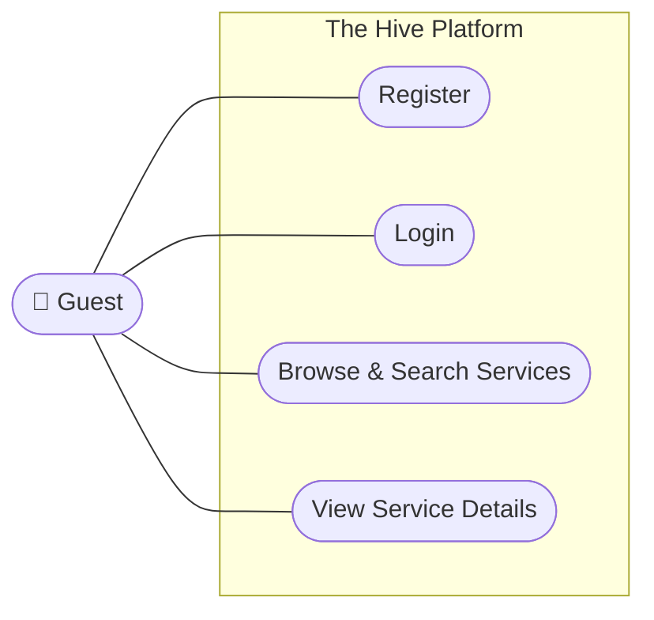

#### 1.2 Registered User Use Cases

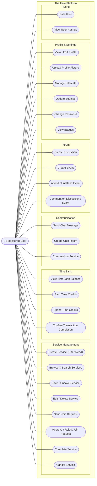

#### 1.3 Moderator & Admin Use Cases

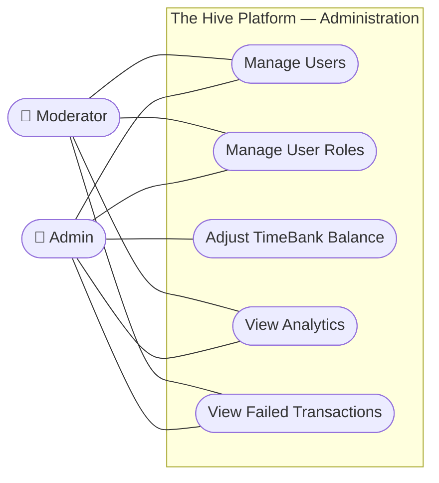

---

### 2. Class Diagram (Domain Model)

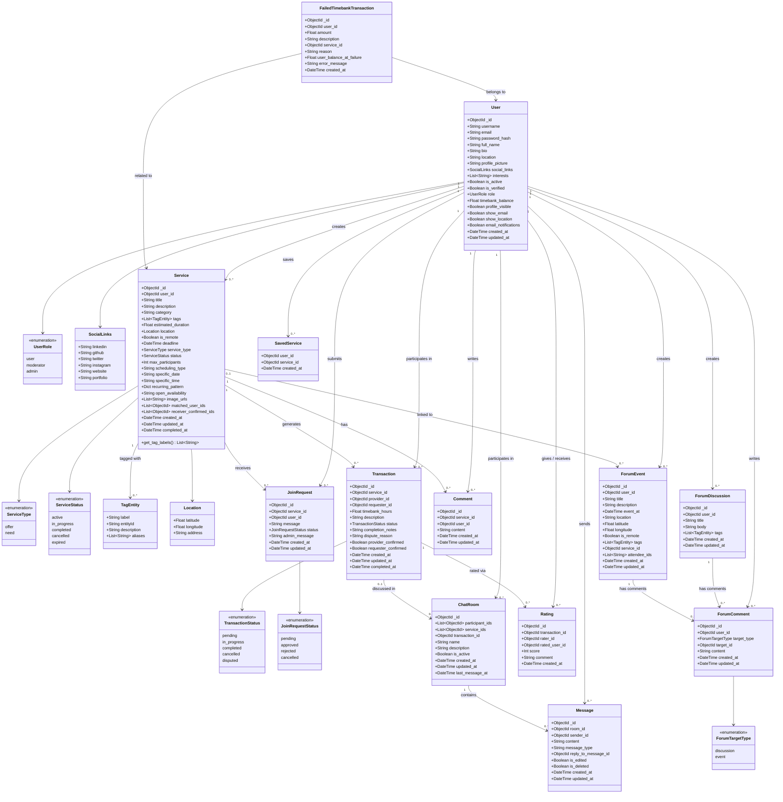

---

### 3. Component Diagram (System Architecture)

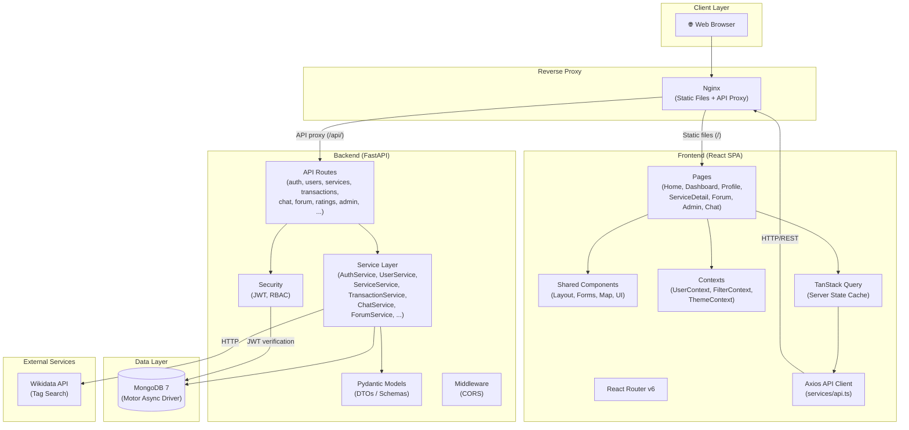

---

### 4. Sequence Diagrams

#### 4.1 User Authentication Flow

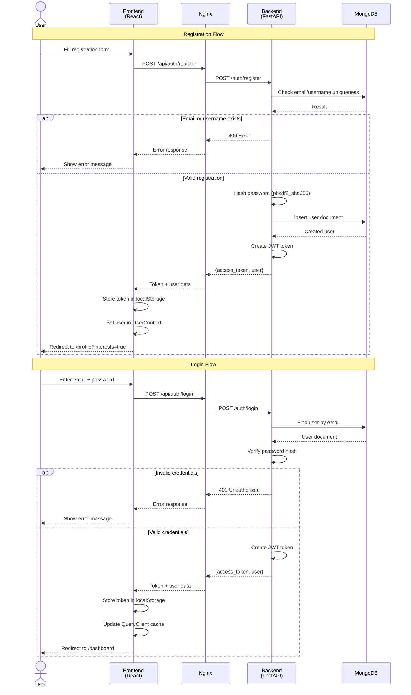

#### 4.2 Service Creation & Matching Flow

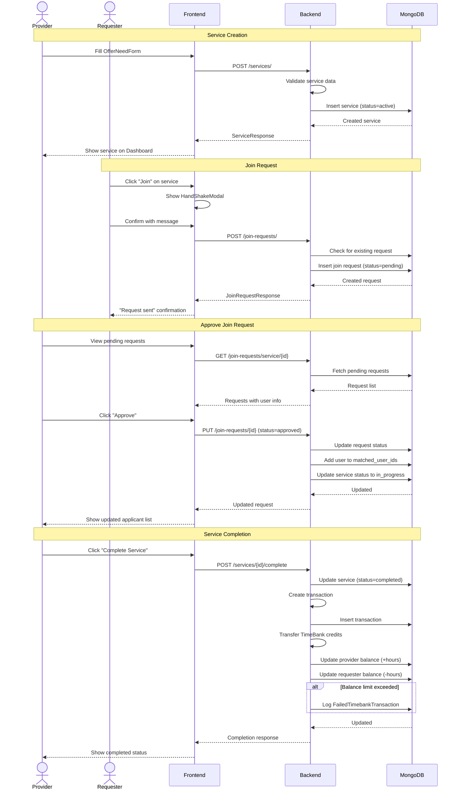

#### 4.3 TimeBank Transaction Flow

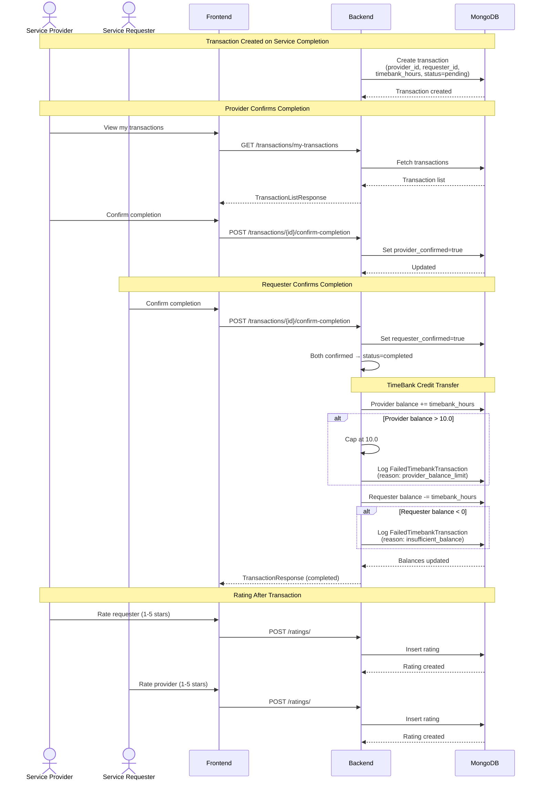

---

### 5. Activity Diagram — Service Exchange Lifecycle

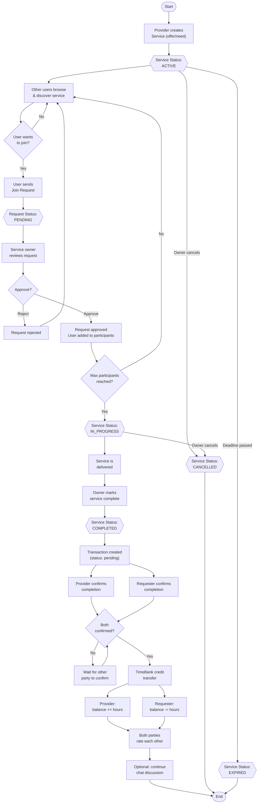

---

### 6. Deployment Diagram

```mermaid
graph TB
    subgraph "Client"
        Browser["🌐 Web Browser<br/>(Any modern browser)"]
    end

    subgraph "Docker Host (Easypanel)"
        subgraph "docker-compose"
            subgraph "Frontend Container"
                NginxServer["Nginx<br/>Port 80"]
                StaticFiles["React SPA<br/>(Built static files)"]
            end

            subgraph "Backend Container"
                FastAPIServer["FastAPI (Uvicorn)<br/>Port 8000"]
                PythonRuntime["Python 3.x Runtime"]
            end

            subgraph "Database Container"
                MongoServer["MongoDB 7<br/>Port 27017"]
                MongoVolume[("mongo_data<br/>Persistent Volume")]
            end
        end
    end

    subgraph "External Services"
        WikidataAPI["Wikidata API<br/>wikidata.org"]
    end

    subgraph "CI/CD"
        GitHubRepo["GitHub Repository<br/>SWE-574"]
        GitHubActions["GitHub Actions<br/>(deploy-easypanel.yml)"]
    end

    Browser -->|"HTTPS"| NginxServer
    NginxServer -->|"Serves static files"| StaticFiles
    NginxServer -->|"Proxy /api/ → :8000"| FastAPIServer
    FastAPIServer --> PythonRuntime
    FastAPIServer -->|"Motor async driver"| MongoServer
    MongoServer --> MongoVolume

    FastAPIServer -.->|"REST API"| WikidataAPI

    GitHubRepo -->|"Push to main"| GitHubActions
    GitHubActions -->|"Deploy"| NginxServer
    GitHubActions -->|"Deploy"| FastAPIServer
```

---

### 7. State Diagram — Service Status

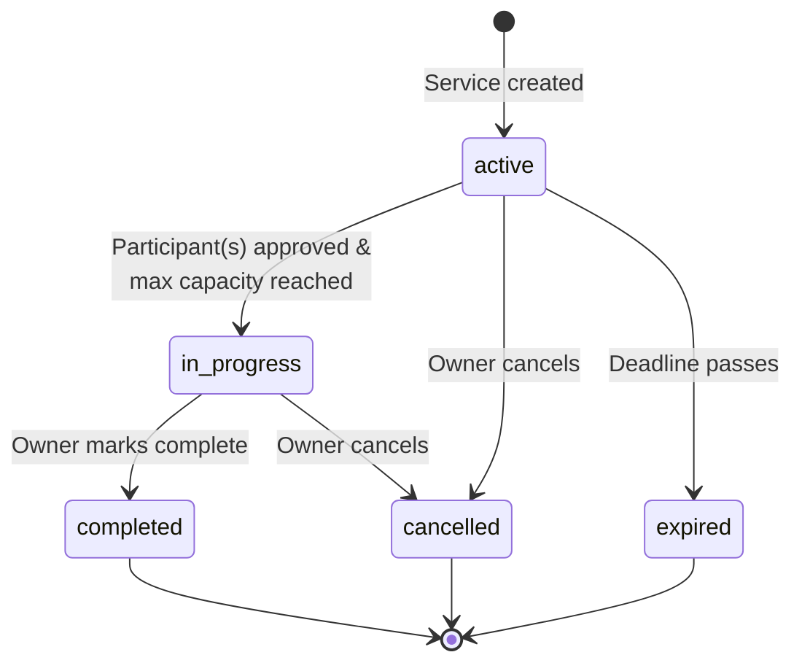

---

### 8. State Diagram — Transaction Status

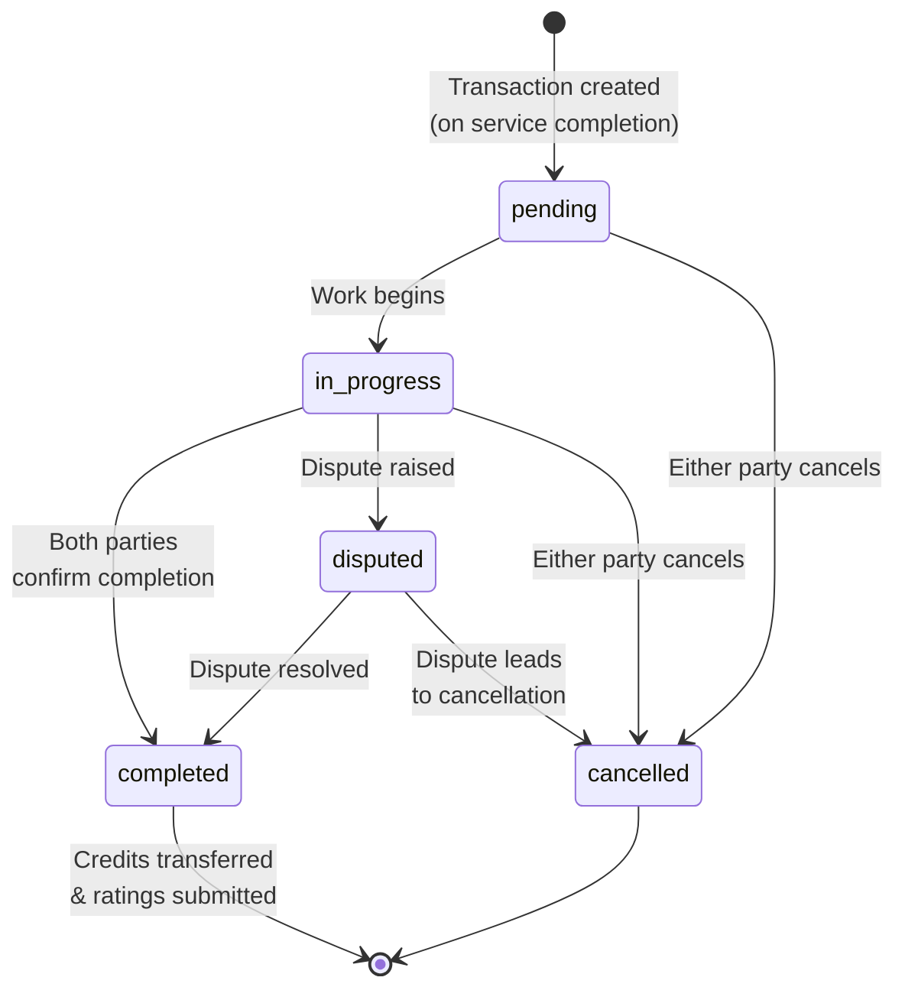
